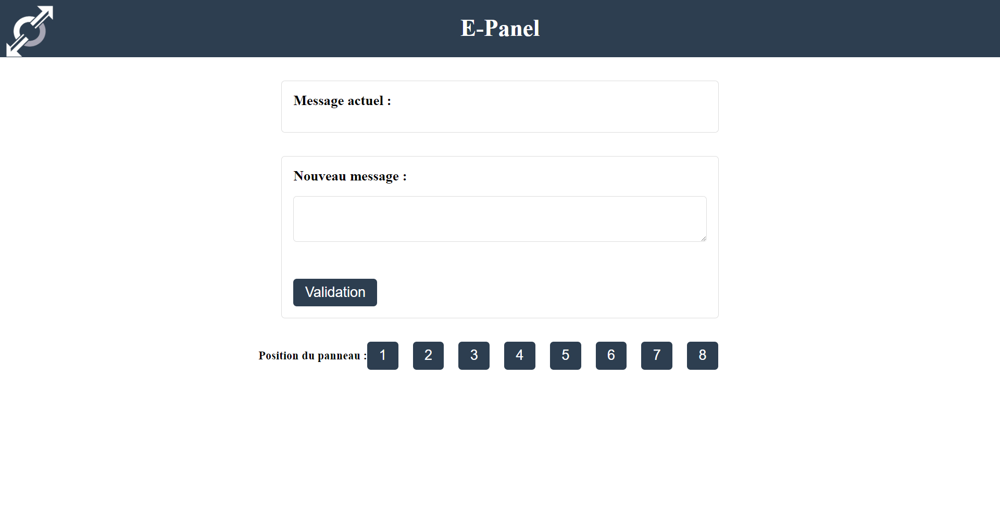
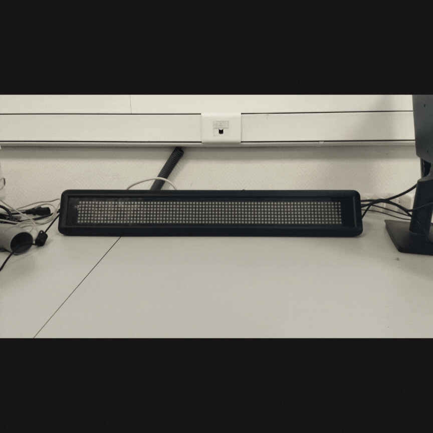

# Mini-projet Epanel 2023

**Epanel** est un projet étudiant de 1°année de BTS SN visant à créer un panneau "journal lumineux" interactif. Le panneau affiche des noms de lieux-dits ainsi que leur direction, et peut être contrôlé via une application web.

## Technologies utilisées

Le projet utilise les technologies suivantes :

- HTML/CSS
- JavaScript
- PHP (Version 8.1.12)
- C++
- MariaDb 10.4.27 (via [XAMPP](https://www.apachefriends.org/fr/index.html))
- Apache 2.4.54 (via [XAMPP](https://www.apachefriends.org/fr/index.html))

## Fonctionnalités

Les principales fonctionnalités du panneau journal lumineux sont les suivantes :

- Affichage des noms de lieux-dits et de leur direction
- Contrôle du panneau via une application web
- Mise à jour dynamique des informations affichées sur le panneau

## Utilisation

Pour utiliser le journal lumineux*, il suffit de se connecter à l'application web correspondante et de contrôler le panneau à partir de l'interface utilisateur. Les mises à jour des informations affichées sont effectuées automatiquement et en temps réel.

> ***Fonctionne uniquement sur ©️ Microsoft Windows** pour cette version

## Base de données

Pour créer la base de données, exécutez cette commande dans le terminal MySQL : ```source C:\chemin\vers\le\fichier.sql```

Ou importez-le dans phpMyAdmin.

Base de données `e-panel` :

```sql
--
-- Base de données : `e-panel`
--
CREATE DATABASE IF NOT EXISTS epanel;
USE epanel;
-- --------------------------------------------------------

--
-- Structure de la table `infopanneau`
--

CREATE TABLE `infopanneau` (
  `ID` int(11) NOT NULL,
  `Message` text NOT NULL,
  `Symbole` text NOT NULL
) ENGINE=InnoDB DEFAULT CHARSET=utf8mb4 COLLATE=utf8mb4_general_ci;

--
-- Chargement de données initiales pour la table `infopanneau`
--

INSERT INTO `infopanneau` (`ID`, `Message`, `Symbole`) VALUES
(1, 'Bus','->'),
(2, 'Metro','->'),
(3, 'Mcdo','->'),
(4, 'Cinema','->'),
(5, 'Mairie','->'),
(6, 'Ecole','->'),
(7, 'Piscine','->'),
(8, 'Republique','->');

--
-- Clé primaire (table `infopanneau`)
--
ALTER TABLE `infopanneau`
  ADD PRIMARY KEY (`ID`);

ALTER TABLE `infopanneau`
  MODIFY `ID` int(11) NOT NULL AUTO_INCREMENT, AUTO_INCREMENT=9;
COMMIT;
```

## Captures

### Interface Homme-Machine



### Journal lumineux



## Auteurs

Ce projet a été réalisé par les étudiants suivants :

- HNIZDO Thomas (IR)
- MAURIN Logan (IR)
- BROUSSE Antoine (EC)

---
©️ LaSalle Avignon - 2023

